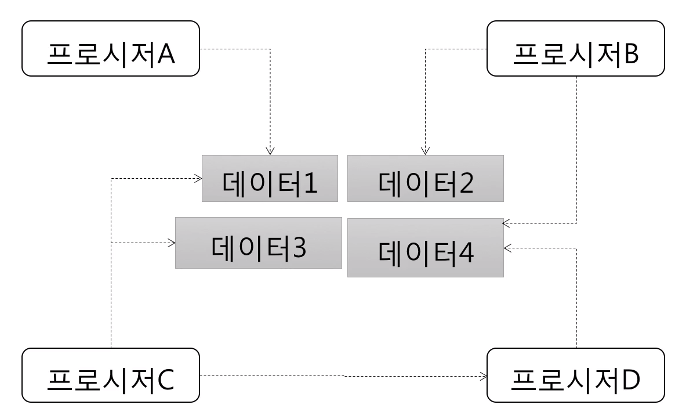
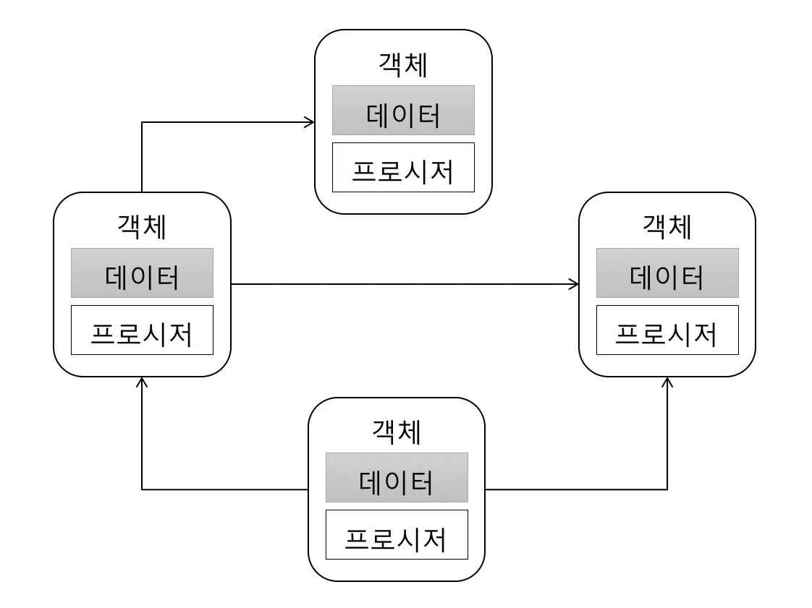

# 최범균님 객체지향과 디자인패턴 정리

 

## Chapter 01. 지저분해지는 코드

### 1. 지저분해지는 코드

### 2. 수정하기 좋은 구조를 가진 코드
Chapter01 예제, 한군데 엉켜있던 메뉴와 버튼 기능을 분리시킴.

### 3. 소프트웨어의 가치
내가 만드는 소프트웨어가 추구해야 할 가치는?  
* 사용자가 요구하는 기능을 충실하게 구현 해야함.  
* 변하는 요구사항에 유연하게 대처할 수 있어야함.

 

## Chapter 02. 객체 지향

### 1. 절차 지향과 객체 지향
> 1.1 절차 지향  

> 1.2 객체 지향

---

### 2. 객체(Object)
> 2.1 객체의 핵심은 기능을 제공하는 것  

객체는 객체가 내부적으로 어떤 데이터를 가지고 있느냐가 아니라  
객체가 제공해야 할 **기능**으로 정의 할 수 있다.

> 2.2 인터페이스와 클래스  

오퍼레이션 (객체가 제공하는 기능)  
 
오퍼레이션의 사용법  
= 시그너처(Signature)  
= 기능 실행 결과 값(리턴 타입), 기능 식별 이름(메소드 이름), 파라미터 및 파라미터 타입  
 
객체지향에서의 **인터페이스**는 객체가 제공하는 모든 오퍼레이션(기능)의 집합을 말한다.  
사용법 보려고 API 들어가서 보는건 시그너처?   

> 2.3 메시지

파일 읽기 객체가 제공하는 **인터페이스**가 다음과 같은 **오퍼레이션**을 제공한다.  
= 파일 읽기 객체가 다음과 같은 기능을 제공한다.  
 
**[ 시그너처 ]**  
리턴 타입 : byte 배열  
오퍼레이션 이름 : read  
파라미터 : 없음  
 
오퍼레이션의 실행을 요청(request)하는 것을 '메시지(message)를 보낸다'고 표현한다.

---

### 3. 객체의 책임과 크기

객체는 각자의 책임이 있다.  
객체는 각자 책임지고 제공해야 할 기능이 있다.  
 
객체가 책임지고 제공해야 할 기능들의 분배, 할당은 처음부터 바로 결정되지 않는다.  
먼저 프로그램을 만들기 위해 필요한 기능들을 목록으로 정리해야 한다.  
객체 지향적 프로그래밍에서 가장 어려우면서 중요한게 객체마다 기능을 책임을 할당하는 과정임.  
 
확실한 규칙 하나. 객체가 갖는 책임의 크기, 제공하는 기능의 개수는 작을수록 좋다.     
단일 책임 원칙을 따르다 보면 자연스럽게 기능의 세부 내용이 변경될 때, 변경해야 할 부분이 한 곳으로 집중된다.  
 
객체 지향 관련 서적이나 글을 읽을 때 나오는 '객체의 역할' = '객체의 책임' = '객체가 제공하는 기능'

---

### 4. 의존

객체A가 제공하는 기능을 이용해서 자신의 기능을 완성하는 객체B  
객체B가 객체A를 생성하거나 객체A의 메서드를 호출할 때, 객체B가 객체A에 의존(dependency)한다라고 한다.  
다른 타입에 의존을 한다는 것은 의존하는 타입에 변경이 발생할 때 나도 함께 변경될 가능성이 높다는 뜻.  

> 4.1 의존의 양면성

내가 변경되면 나에게 의존하고 있는(나를 사용하고 있는) 코드에 영향을 준다.  
나의 요구가 변경되면 내가 의존하고 있는(내가 사용하고 있는) 타입에 영향을 준다.  

---

### 5. 캡슐화

캡슐화(encapsulation)는 객체가 내부적으로 기능을 어떻게 구현하는지를 감추는 것이다.  
이를 통해 내부의 기능 구현이 변경되더라도 그 기능을 사용하는(의존하는) 코드는 영향을 받지 않도록 만들어 준다.  

> 5.1 절차 지향 방식 코드  

데이터를 중심으로 프로그래밍하는 절차 지향적 코드의 문제점  
(데이터를 사용하는 클래스들은 요구사항이 변경되면 각각 개별적으로 수정 해줘야 한다.)

> 5.2 캡슐화 된 기능 구현  

캡슐화는 기능이 내부적으로 어떻게 구현되었는지를 숨기는 것이다라  
이 챕터의 예제의 경우는 만료 여부를 검사하는 기능이 캡슐화의 대상이다.  

> 5.3 캡슐화의 결과는 내부 구현 변경의 유연성 획득  

> 5.4 캡슐화를 위한 두 개의 규칙

* Tell, Don't Ask (**말해라** 뭐라고? 기능을 실행해 달라고, **물어보지말고** 뭘? 데이터를)
* 데미테르의 법칙 (Law of Demeter)  
  ㄴ **메서드에서 생성한 객체**의 메서드만 호출  

  ㄴ **파라미터로 받은 객체**의 메서드만 호출  
  
  ㄴ **필드로 참조하는 객체**의 메서드만 호출  

재밌는 신문 배달부와 지갑 예제  
ㄴ 데미테르의 법칙을 어기면 신문 배달부가 고객의 지갑을 가져다가 돈을 꺼내가는 상황이 발생

### 6. 객체 지향 설계 과정

1. 제공해야 할 기능을 찾고 세분화한다.
2. 기능을 구현하는데 필요한 데이터를 객체에 추가한다.  
(반대로 데이터를 먼저 추가하고 그 데이터를 사용하는 기능을 넣을 수도 있다고)  
3. 객체 간에 어떻게 메시지를 주고받을 지 결정한다.
4. 요 과정을 계속 반복한다.

